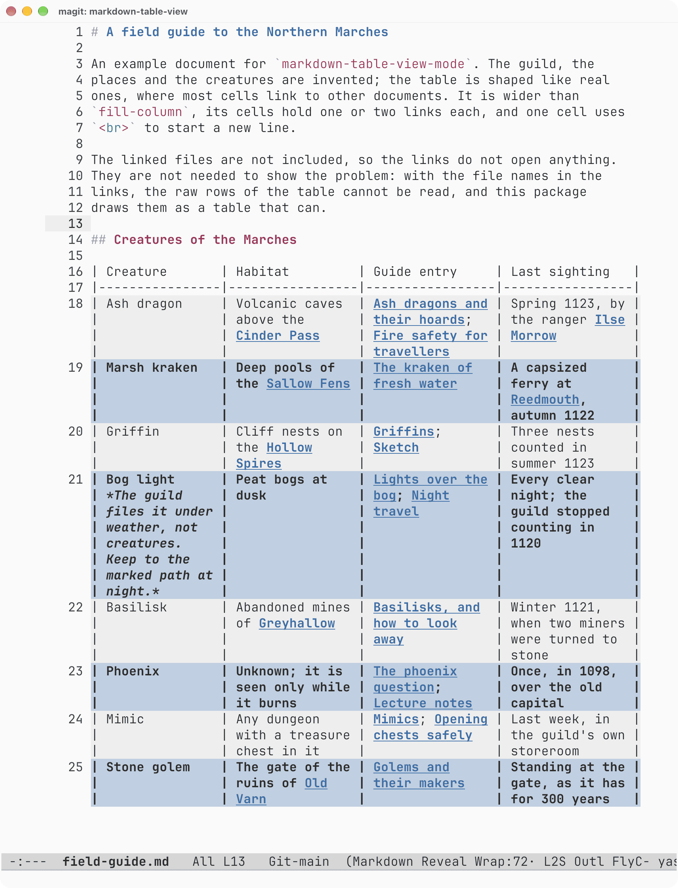

# markdown-table-view


[](https://github.com/alberti42/markdown-table-view.el/actions/workflows/melpazoid.yml)
[](https://github.com/alberti42/markdown-table-view.el/actions/workflows/ci.yml)
[](LICENSE)

`markdown-table-view-mode` is a buffer-local minor mode for the `markdown-ts-mode` bundled with Emacs 31. It changes how pipe tables are displayed and nothing else: the buffer text is never modified, and nothing of `markdown-ts-mode` is replaced or advised.

Column widths come from the text a reader sees in each cell: characters that are invisible (for example link markup hidden by `markdown-ts-hide-markup`) take no room. When the table is wider than `markdown-table-view-width`, the widest columns are narrowed and their cells are word-wrapped onto several screen lines. `<br>` in a cell starts a new line.

## Why

A table is there to give an overview: the reader sees the rows and columns together and compares them. Markdown writes each table row on one line, and once the cells hold links, a row is several times wider than the window. Emacs can show such a row in two ways, and both lose the overview:

- With long lines wrapped, a row fills several screen lines, and nothing shows where one row ends and the next begins.
- With long lines truncated, each row stays on one line and the window shows only its first columns: the reader scrolls sideways to read a row and never sees the whole table.

`markdown-table-view-mode` draws the table no wider than `markdown-table-view-width` (by default `fill-column`). Each cell stays in its column and wraps inside it, hidden link markup takes no room, and data rows alternate their backgrounds, so each row can be told from the next. The buffer text is never modified, so the file stays a plain Markdown table for every other tool.

The pipe tables of GitHub Flavored Markdown, which `markdown-ts-mode` reads, have no syntax for writing one row over several lines. A proposal to add one, with continuation lines that begin with `┆` or `|~`, is under discussion on the CommonMark forum: [Let table rows wrap over several lines](https://talk.commonmark.org/t/let-table-rows-wrap-over-several-lines/9133). It would fix the problem at its root, in the source text, so that a table could be read with no viewer such as this package. It is mentioned here only as that alternative: this package does not implement it, and draws only tables whose rows are written on one line each. The most likely outcome is that no such syntax is adopted. If one is, the files already written with one row per line remain, and they need a viewer for some time.

## Example

[`examples/field-guide.md`](examples/field-guide.md) holds an invented field guide. Markdown writes each table row on one line, so in a window 72 columns wide, with long lines wrapped, its first two data rows look like this:

```markdown
| Creature | Habitat | Guide entry | Last sighting |
|---|---|---|---|
| Ash dragon | Volcanic caves above the [Cinder
Pass](atlas/regions/cinder-pass.md#caves) | [Ash dragons and their
hoards](bestiary/dragons.md#ash-dragon); [Fire safety for
travellers](handbook/fire.md#dragons) | Spring 1123, by the ranger
[Ilse Morrow](people/rangers.md#ilse-morrow) |
| Marsh kraken | Deep pools of the [Sallow
Fens](atlas/regions/sallow-fens.md#pools) | [The kraken of fresh
water](bestiary/sea-beasts.md#marsh-kraken) | A capsized ferry at
[Reedmouth](atlas/towns/reedmouth.md#harbour), autumn 1122 |
```

With `markdown-ts-hide-markup` on and `fill-column` set to 72, the mode draws those rows as:

```text
| Creature       | Habitat         | Guide entry     | Last sighting   |
|----------------|-----------------|-----------------|-----------------|
| Ash dragon     | Volcanic caves  | Ash dragons and | Spring 1123, by |
|                | above the       | their hoards;   | the ranger Ilse |
|                | Cinder Pass     | Fire safety for | Morrow          |
|                |                 | travellers      |                 |
| Marsh kraken   | Deep pools of   | The kraken of   | A capsized      |
|                | the Sallow Fens | fresh water     | ferry at        |
|                |                 |                 | Reedmouth,      |
|                |                 |                 | autumn 1122     |
```

The link labels keep the faces `markdown-ts-mode` gives them, and clicking one follows the link. Data rows are drawn with alternating backgrounds, which a text block cannot show; the screenshot below shows them.



The screenshot shows `examples/field-guide.md` in a graphical frame, with the doom-opera-light theme and `fill-column` set to 72. Markup is shown, so the `#` of the headings, the backticks and the `*` around the note in the Bog light row are visible. The link destinations are hidden by a setting of the author's configuration that is not part of this package. `C-c C-x C-m` (`markdown-ts-toggle-hide-markup`) makes `markdown-ts-mode` hide all markup, the link destinations included.

## Requirements

- Emacs 31.1 or later, for `markdown-ts-mode`.
- The `markdown` and `markdown-inline` tree-sitter grammars, which `markdown-ts-mode` needs too. `M-x treesit-install-language-grammar` installs them.

Both are part of Emacs or fetched by it; the package needs nothing else.

## Installation

The package is not published yet. Clone the repository and add it to `load-path`:

```elisp
(use-package markdown-table-view
  :load-path "~/path/to/markdown-table-view"
  :hook (markdown-ts-mode-hook . markdown-table-view-mode))
```

With straight.el, from a local clone:

```elisp
(use-package markdown-table-view
  :straight (markdown-table-view
             :type git
             :local-repo "~/path/to/markdown-table-view")
  :hook (markdown-ts-mode-hook . markdown-table-view-mode))
```

## Usage

`M-x markdown-table-view-mode` turns the mode on in the current buffer; the hook above turns it on in every `markdown-ts-mode` buffer.

- The row point is on is shown as its raw text, so it can be edited and its links followed with RET.
- After a scroll command, a row point moved onto stays drawn until the next command. A scroll command is one with a non-nil `scroll-command` property: `mwheel-scroll`, `pixel-scroll-precision`, `scroll-up-command`, `scroll-down-command` and the other scroll commands of Emacs.
- Clicking a character of a drawn row moves point to that character in the buffer, and follows the link there if there is one.
- `markdown-ts-toggle-hide-markup` (`C-c C-x C-m`) shows and hides the markup; the tables are drawn again with the new widths.

## Options

|Option                                |Default|Meaning                                                                      |
|--------------------------------------|-------|-----------------------------------------------------------------------------|
|`markdown-table-view-width`           |`nil`  |Maximum width, in columns, of a displayed table. When nil, use `fill-column`.|
|`markdown-table-view-min-column-width`|`8`    |Width below which a column is not narrowed to fit the table width.           |
|`markdown-table-view-stripe-rows`     |`t`    |Non-nil means data rows are drawn with alternating backgrounds.              |
|`markdown-table-view-row-lines`       |`nil`  |Non-nil means a line is drawn under each data row but the last.              |

Setting `fill-column` (`C-x f`) or one of these options draws the tables again in the buffers where the mode is on.

The first, third, ... data rows are drawn with the face `markdown-table-view-row` and the background of `hl-line`; the others with `markdown-table-view-stripe` and the background of `lazy-highlight`, the face agent-shell's tables use. Both faces inherit `markdown-ts-table`, and only the background is taken from `hl-line` and `lazy-highlight`, so a theme that makes `lazy-highlight` bold does not make the rows bold. The theme sets both backgrounds, for a light theme and a dark one alike, and the tables are drawn again when a theme is enabled. A background set on `markdown-table-view-row` or `markdown-table-view-stripe` takes the place of the theme's. The line is the underline of the face `markdown-table-view-row-line`, so it takes no screen line of its own; in a terminal it is an ordinary underline. Both faces are added after the faces of the cell text, so a link or a code span keeps its own colours.

## Links and emphasis in table cells

`markdown-ts-mode` runs the `markdown-inline` grammar only on `inline` nodes, and a table cell is not one, so links, emphasis and code in a cell are not fontified and their markup is not hidden. While the mode is on, it runs the grammar on table cells too, and `markdown-ts-mode` fontifies them as it fontifies a paragraph. The mode adds this rule only when `treesit-range-settings` does not already run the grammar on table cells, so once `markdown-ts-mode` parses table cells itself, the mode adds nothing.  Turning the mode off removes the rule.

## Hiding link markup with spaces

A configuration that hides link markup with `(space :width N)`, to keep raw tables aligned, makes that markup count as N spaces here. Such a configuration should use `invisible` while this mode is on.

## Tests

```sh
make test
```

The tests run in `emacs --batch --quick`. The tests that draw tables need the `markdown` and `markdown-inline` grammars and are skipped without them.

The CI workflow installs both grammars and runs byte-compilation, checkdoc and the tests on Emacs 31.1 and on Emacs master. The melpazoid workflow runs the checks MELPA's reviewers run.

## Versions and changes

Version numbers follow [Semantic Versioning 2.0.0](https://semver.org/spec/v2.0.0.html). [`CHANGELOG.md`](CHANGELOG.md) follows [Keep a Changelog 1.1.0](https://keepachangelog.com/en/1.1.0/), and the text of each GitHub release is its version's section there.

## Verifying a release

Each GitHub release carries `markdown-table-view-X.Y.Z.tar.gz`, built from the tag with `git archive`, the file `markdown-table-view.el`, and `SHA256SUMS`. The release workflow attests the provenance of the first two: a signed statement that the workflow produced these bytes from the tag's commit. To check a downloaded file:

```sh
gh attestation verify markdown-table-view-X.Y.Z.tar.gz --repo alberti42/markdown-table-view.el
```

`SHA256SUMS` only shows that a download is not corrupted, because it is published beside the files it describes. The attestation is kept in GitHub's attestation store, so replacing a release asset does not replace its attestation.

## License

GPL-3.0-or-later. Copyright (C) 2026 Andrea Alberti.
